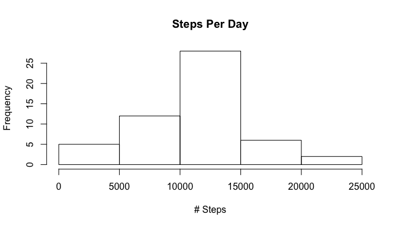
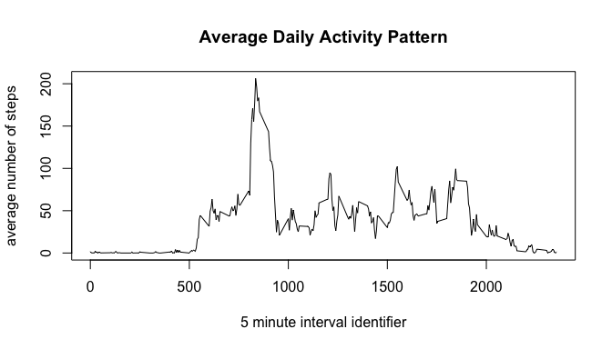
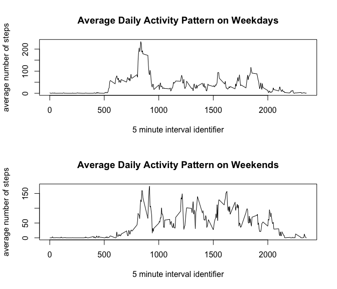

# Reproducible Research: Peer Assessment 1

```
## 
## Attaching package: 'dplyr'
## 
## The following object is masked from 'package:stats':
## 
##     filter
## 
## The following objects are masked from 'package:base':
## 
##     intersect, setdiff, setequal, union
```

## Loading and preprocessing the data

```r
activity <- read.csv(unz("activity.zip", "activity.csv"), na.strings="NA")
```

## What is mean total number of steps taken per day?
Here is a histogram showing the frequency of steps per day

```r
activityByDay <- aggregate(steps ~ date, na.omit(activity), sum)
hist(activityByDay$steps, main="Steps Per Day", xlab="# Steps")
```

 

Here is the mean and median steps per day

```r
mean(activityByDay$steps)
```

```
## [1] 10766.19
```

```r
median(activityByDay$steps)
```

```
## [1] 10765
```


## What is the average daily activity pattern?
This plot shows average number of steps per interval:

```r
activityPattern <- aggregate(steps ~ interval, na.omit(activity), mean)
plot(activityPattern$interval, activityPattern$steps, type="l", main="Average Daily Activity Pattern", xlab="5 minute interval identifier", ylab="average number of steps")
```

 

This interval has the maximum average number of steps per day:

```r
activityPattern[which.max(activityPattern$steps),]$interval
```

```
## [1] 835
```

## Imputing missing values
Here is the number of entries with a missing step count:

```r
sum(is.na(activity$steps))
```

```
## [1] 2304
```

We are going create a modified dataset by replacing each missing value with the overall average # of steps for that interval.

```r
clean_activity <- activity
for (i in which(sapply(clean_activity, is.na))) {
   clean_activity[i,]$steps <- activityPattern[activityPattern$interval==clean_activity[i,]$interval,]$steps}
```

Here is a histogram showing the frequency of steps per day in the modified dataset

```r
modactivityByDay <- aggregate(steps ~ date, clean_activity, sum)
hist(modactivityByDay$steps, main="Steps Per Day", xlab="# Steps")
```

 

The frequency of daily stepcounts between 10k and 15k increases significantly with the imputed data.

Here is the mean and median steps per day in the modified dataset.  Neither are significantly impacted by imputing the missing data.

```r
mean(modactivityByDay$steps)
```

```
## [1] 10766.19
```

```r
median(modactivityByDay$steps)
```

```
## [1] 10766.19
```


## Are there differences in activity patterns between weekdays and weekends?
Let's add columns to our dataset indicating if each date is a weekend or weekday)

```r
tbl_df(activity)
```

```
## Source: local data frame [17,568 x 3]
## 
##    steps       date interval
## 1     NA 2012-10-01        0
## 2     NA 2012-10-01        5
## 3     NA 2012-10-01       10
## 4     NA 2012-10-01       15
## 5     NA 2012-10-01       20
## 6     NA 2012-10-01       25
## 7     NA 2012-10-01       30
## 8     NA 2012-10-01       35
## 9     NA 2012-10-01       40
## 10    NA 2012-10-01       45
## ..   ...        ...      ...
```

```r
activity <- mutate(activity, weekday=(as.POSIXlt(date,format="%Y-%m-%d")$wday %in% c(1,2,3,4,5)))
```


```r
par(mfrow=c(2,1))
weekdayActivityPattern <- aggregate(steps ~ interval, na.omit(filter(activity, weekday == TRUE)), mean)
weekendActivityPattern <- aggregate(steps ~ interval, na.omit(filter(activity, weekday == FALSE)), mean)
plot(weekdayActivityPattern$interval, weekdayActivityPattern$steps, type="l", main="Average Daily Activity Pattern on Weekdays", xlab="5 minute interval identifier", ylab="average number of steps")
plot(weekendActivityPattern$interval, weekendActivityPattern$steps, type="l", main="Average Daily Activity Pattern on Weekends", xlab="5 minute interval identifier", ylab="average number of steps")
```

 
